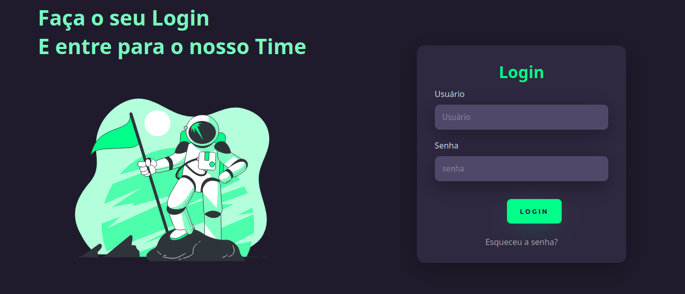
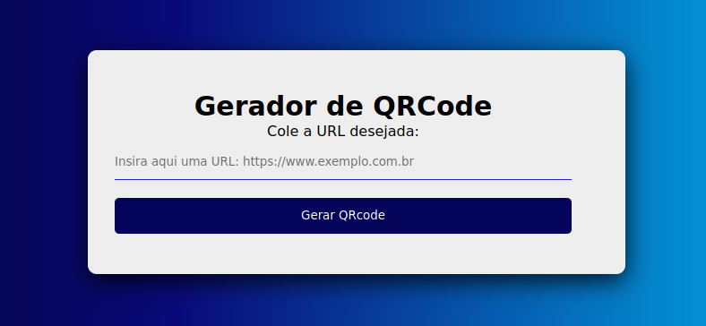
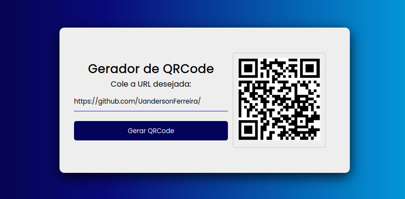
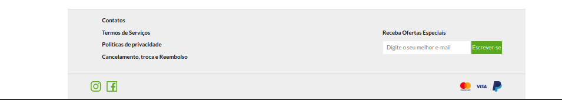
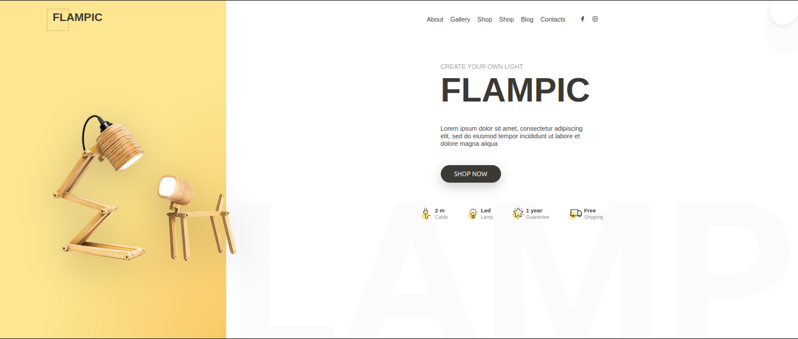

# PROJETOS-WEB
 Repositório central dos projetos web, voltado para o meu estudo de desenvolvimento web, por meio de projetos pessoais e projetos de terceiros do youtuber.

 ## Projeto 1

-> Construção de uma página de login simples

Link do tutorial: https://www.youtube.com/watch?v=69-WfrVBli8 

 

## Projeto 4

-> Consumindo uma api de geração de QRcode

### 1°- Página Inicial

### 2°- Gerando o QRcode baseado na url passada

 

## Projeto 5

-> Construção de um Interface para um site de vendas, utilizando o conceito de Pixel Perfect.

Link do tutorial: 

 

## Projeto 6

->Construção de um Banner, aplicando os conceitos do Pixel Perfect.

Link do tutorial: 

 

