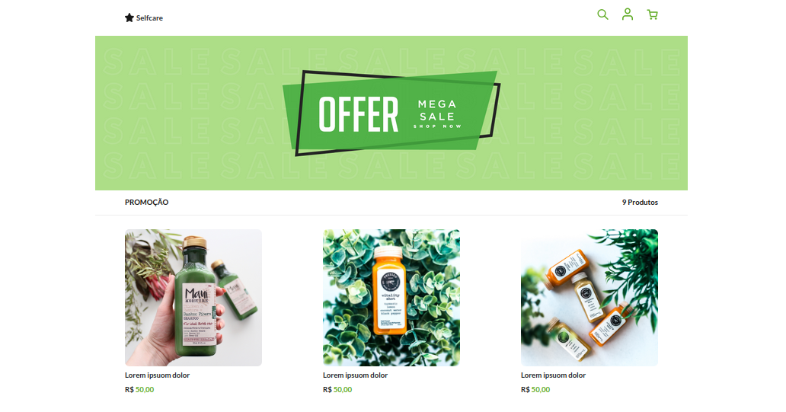

# PROJETOS-WEB
 Repositório central dos projetos web, voltado para o meu estudo de desenvolvimento web, por meio de projetos pessoais e projetos de terceiros do youtuber.

 ## Projeto 1

- Construção de uma página de login simples
  
- Tecnologias usadas: 
   - HTML5
   - CSS3

Link do projeto: https://uandersonferreira.github.io/PROJETOS-WEB/Projetos/projeto01/

Link do tutorial: https://www.youtube.com/watch?v=69-WfrVBli8 

 

 ## Projeto 2

- Construção de uma interface de um site culinário responsivo, compatível com dispositivos móveis.
  
- Tecnologias usadas: 
   - HTML5
   - CSS3
   - JavaScript

Link do projeto: https://uandersonferreira.github.io/PROJETOS-WEB/Projetos/projeto02/

Link do tutorial: https://www.youtube.com/watch?v=ac5nmWOkBEY

 

## Projeto 4

- Consumindo uma api de geração de QRcode
- Tecnologias usadas: 
   - HTML5
   - CSS3
   - JavaScript

### 1°- Página Inicial

### 2°- Gerando o QRcode baseado na url passada

Link do projeto:

Link do tutorial: https://www.youtube.com/watch?v=UOIDhGCGCio

 

## Projeto 5

-> Construção de um Interface para um site de vendas, utilizando o conceito de Pixel Perfect.

- Tecnologias usadas: 
   - HTML5
   - CSS3

Link do projeto:

Link do tutorial: https://www.youtube.com/watch?v=ngKPeseBlmc&list=PLOfKzAi2JkAgYAH-lwDzLqXwNdYAWtyei

 

## Projeto 6

->Construção de um Banner, aplicando os conceitos do Pixel Perfect.

- Tecnologias usadas: 
   - HTML5
   - CSS3
   

Link do projeto:

Link do tutorial: https://www.youtube.com/watch?v=rboSA7728kk&list=PLOfKzAi2JkAii9XnoLx3r6jsCdg4bs4t7

 

## Projeto 8

-> Construção de um Interface de um site simples usando Bootstrap e Unsplash que é uma fonte da internet de imagens livremente utilizáveis. 

- Tecnologias usadas: 
   - HTML5
   - Bootstrap
   
   

Link do projeto:

